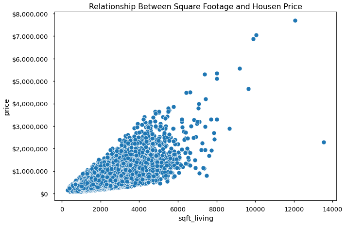
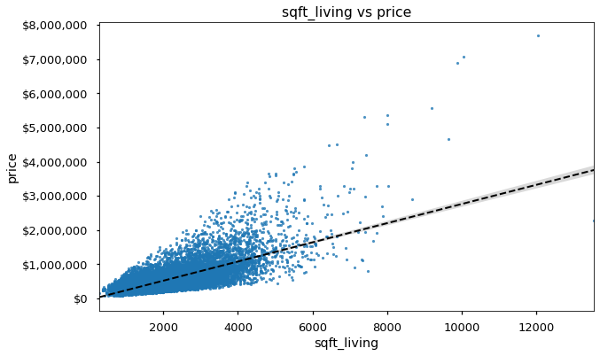

# From Linear to Logistic: a Brief Introduction to Logistic Regression


<h1>Table of Contents<span class="tocSkip"></span></h1>
<div class="toc"><ul class="toc-item"><li><span><a href="#From-Linear-to-Logistic:-a-Brief-Introduction-to-Logistic-Regression" data-toc-modified-id="From-Linear-to-Logistic:-a-Brief-Introduction-to-Logistic-Regression-1"><span class="toc-item-num">1&nbsp;&nbsp;</span>From Linear to Logistic: a Brief Introduction to Logistic Regression</a></span><ul class="toc-item"><li><span><a href="#Learning-Objectives" data-toc-modified-id="Learning-Objectives-1.1"><span class="toc-item-num">1.1&nbsp;&nbsp;</span>Learning Objectives</a></span></li></ul></li><li><span><a href="#Predicting-the-Price-of-a-Home-Using-Linear-Regression" data-toc-modified-id="Predicting-the-Price-of-a-Home-Using-Linear-Regression-2"><span class="toc-item-num">2&nbsp;&nbsp;</span>Predicting the Price of a Home Using Linear Regression</a></span><ul class="toc-item"><li><span><a href="#🕹Activity:-Visualizing-Our-Features-vs-Our-Target" data-toc-modified-id="🕹Activity:-Visualizing-Our-Features-vs-Our-Target-2.1"><span class="toc-item-num">2.1&nbsp;&nbsp;</span><del>🕹Activity:</del> Visualizing Our Features vs Our Target</a></span><ul class="toc-item"><li><span><a href="#Functionizing-Our-Code" data-toc-modified-id="Functionizing-Our-Code-2.1.1"><span class="toc-item-num">2.1.1&nbsp;&nbsp;</span>Functionizing Our Code</a></span></li><li><span><a href="#What-Our-Trendline-Tells-Us" data-toc-modified-id="What-Our-Trendline-Tells-Us-2.1.2"><span class="toc-item-num">2.1.2&nbsp;&nbsp;</span>What Our Trendline Tells Us</a></span></li></ul></li><li><span><a href="#🕹Activity:-Predicting-House-Price-with-LinearRegression" data-toc-modified-id="🕹Activity:-Predicting-House-Price-with-LinearRegression-2.2"><span class="toc-item-num">2.2&nbsp;&nbsp;</span>🕹Activity: Predicting House Price with <code>LinearRegression</code></a></span><ul class="toc-item"><li><span><a href="#What-Coefficients-Did-Our-Model-Find?" data-toc-modified-id="What-Coefficients-Did-Our-Model-Find?-2.2.1"><span class="toc-item-num">2.2.1&nbsp;&nbsp;</span>What Coefficients Did Our Model Find?</a></span></li></ul></li><li><span><a href="#Linear-Regression-Summary" data-toc-modified-id="Linear-Regression-Summary-2.3"><span class="toc-item-num">2.3&nbsp;&nbsp;</span>Linear Regression Summary</a></span></li></ul></li><li><span><a href="#Predicting-the-Probability-of-a-Being-an-Expensive-Home-Logistic-Regression" data-toc-modified-id="Predicting-the-Probability-of-a-Being-an-Expensive-Home-Logistic-Regression-3"><span class="toc-item-num">3&nbsp;&nbsp;</span>Predicting the Probability of a Being an Expensive Home Logistic Regression</a></span><ul class="toc-item"><li><span><a href="#🕹Activity:-Converting-Our-Task-to-A-Classifcation-Task" data-toc-modified-id="🕹Activity:-Converting-Our-Task-to-A-Classifcation-Task-3.1"><span class="toc-item-num">3.1&nbsp;&nbsp;</span><del>🕹Activity:</del> Converting Our Task to A Classifcation Task</a></span><ul class="toc-item"><li><span><a href="#Visualizing-Our-Features-vs-our-New-Binary-Taget" data-toc-modified-id="Visualizing-Our-Features-vs-our-New-Binary-Taget-3.1.1"><span class="toc-item-num">3.1.1&nbsp;&nbsp;</span>Visualizing Our Features vs our New Binary Taget</a></span></li><li><span><a href="#When-straight-lines-aren't-enough...." data-toc-modified-id="When-straight-lines-aren't-enough....-3.1.2"><span class="toc-item-num">3.1.2&nbsp;&nbsp;</span>When straight lines aren't enough....</a></span></li><li><span><a href="#Converting-Our-Linear-Equation-to-A-Sigmoid-Curve" data-toc-modified-id="Converting-Our-Linear-Equation-to-A-Sigmoid-Curve-3.1.3"><span class="toc-item-num">3.1.3&nbsp;&nbsp;</span>Converting Our Linear Equation to A Sigmoid Curve</a></span></li></ul></li><li><span><a href="#🕹Activity:-Predicting-if-a-House-Belongs-to-the-&quot;Expensive-Home&quot;-class." data-toc-modified-id="🕹Activity:-Predicting-if-a-House-Belongs-to-the-&quot;Expensive-Home&quot;-class.-3.2"><span class="toc-item-num">3.2&nbsp;&nbsp;</span>🕹Activity: Predicting if a House Belongs to the "Expensive Home" class.</a></span></li></ul></li><li><span><a href="#Next-Class" data-toc-modified-id="Next-Class-4"><span class="toc-item-num">4&nbsp;&nbsp;</span>Next Class</a></span></li><li><span><a href="#Questions?" data-toc-modified-id="Questions?-5"><span class="toc-item-num">5&nbsp;&nbsp;</span>Questions?</a></span></li><li><span><a href="#Appendix" data-toc-modified-id="Appendix-6"><span class="toc-item-num">6&nbsp;&nbsp;</span>Appendix</a></span><ul class="toc-item"><li><ul class="toc-item"><li><span><a href="#Interpreting-Odds-Coefficients" data-toc-modified-id="Interpreting-Odds-Coefficients-6.0.1"><span class="toc-item-num">6.0.1&nbsp;&nbsp;</span>Interpreting Odds Coefficients</a></span></li><li><span><a href="#Titanic" data-toc-modified-id="Titanic-6.0.2"><span class="toc-item-num">6.0.2&nbsp;&nbsp;</span>Titanic</a></span></li></ul></li></ul></li></ul></div>

## Learning Objectives
- To review how linear regression predicts a continuous value.
- To understand how we can convert a linear equation to a sigmoid curve bounded between 0 and 1. 
- To understand how Logistic Regression uses sigmoid curves to predict the probability of belonging to a specific class/category/label.
- To apply both Linear Regression and Logistic Regression using sci-kit learn.

- Prerequisites/Assumptions:
    - Some Familiarity with Linear Regression

# Predicting the Price of a Home Using Linear Regression


```python
## personal pypi package
# !pip install -U fsds
from fsds.imports import *
```

    fsds v0.4.10 loaded.


<script type="text/javascript">
window.PlotlyConfig = {MathJaxConfig: 'local'};
if (window.MathJax) {MathJax.Hub.Config({SVG: {font: "STIX-Web"}});}
if (typeof require !== 'undefined') {
require.undef("plotly");
requirejs.config({
    paths: {
        'plotly': ['https://cdn.plot.ly/plotly-2.4.2.min']
    }
});
require(['plotly'], function(Plotly) {
    window._Plotly = Plotly;
});
}
</script>


```python
## additional required imports
from sklearn.model_selection import train_test_split
from sklearn.metrics import (r2_score, plot_confusion_matrix,
                             classification_report)

## Customized Options
pd.set_option('display.float_format',lambda x: f"{x:,.4f}")
plt.style.use('seaborn-talk')
```


```python
## Load in the King's County housing dataset and display the head and info
df = fs.datasets.load_king_county_housing(project_vers=False)
display(df.head(),df.info())
```

    <class 'pandas.core.frame.DataFrame'>
    RangeIndex: 21613 entries, 0 to 21612
    Data columns (total 21 columns):
     #   Column         Non-Null Count  Dtype  
    ---  ------         --------------  -----  
     0   id             21613 non-null  int64  
     1   date           21613 non-null  object 
     2   price          21613 non-null  float64
     3   bedrooms       21613 non-null  int64  
     4   bathrooms      21613 non-null  float64
     5   sqft_living    21613 non-null  int64  
     6   sqft_lot       21613 non-null  int64  
     7   floors         21613 non-null  float64
     8   waterfront     21613 non-null  int64  
     9   view           21613 non-null  int64  
     10  condition      21613 non-null  int64  
     11  grade          21613 non-null  int64  
     12  sqft_above     21613 non-null  int64  
     13  sqft_basement  21613 non-null  int64  
     14  yr_built       21613 non-null  int64  
     15  yr_renovated   21613 non-null  int64  
     16  zipcode        21613 non-null  int64  
     17  lat            21613 non-null  float64
     18  long           21613 non-null  float64
     19  sqft_living15  21613 non-null  int64  
     20  sqft_lot15     21613 non-null  int64  
    dtypes: float64(5), int64(15), object(1)
    memory usage: 3.5+ MB


<div>
<style scoped>
    .dataframe tbody tr th:only-of-type {
        vertical-align: middle;
    }

    .dataframe tbody tr th {
        vertical-align: top;
    }

    .dataframe thead th {
        text-align: right;
    }
</style>
<table border="1" class="dataframe">
  <thead>
    <tr style="text-align: right;">
      <th></th>
      <th>id</th>
      <th>date</th>
      <th>price</th>
      <th>bedrooms</th>
      <th>bathrooms</th>
      <th>sqft_living</th>
      <th>sqft_lot</th>
      <th>floors</th>
      <th>waterfront</th>
      <th>view</th>
      <th>...</th>
      <th>grade</th>
      <th>sqft_above</th>
      <th>sqft_basement</th>
      <th>yr_built</th>
      <th>yr_renovated</th>
      <th>zipcode</th>
      <th>lat</th>
      <th>long</th>
      <th>sqft_living15</th>
      <th>sqft_lot15</th>
    </tr>
  </thead>
  <tbody>
    <tr>
      <th>0</th>
      <td>7129300520</td>
      <td>20141013T000000</td>
      <td>221,900.0000</td>
      <td>3</td>
      <td>1.0000</td>
      <td>1180</td>
      <td>5650</td>
      <td>1.0000</td>
      <td>0</td>
      <td>0</td>
      <td>...</td>
      <td>7</td>
      <td>1180</td>
      <td>0</td>
      <td>1955</td>
      <td>0</td>
      <td>98178</td>
      <td>47.5112</td>
      <td>-122.2570</td>
      <td>1340</td>
      <td>5650</td>
    </tr>
    <tr>
      <th>1</th>
      <td>6414100192</td>
      <td>20141209T000000</td>
      <td>538,000.0000</td>
      <td>3</td>
      <td>2.2500</td>
      <td>2570</td>
      <td>7242</td>
      <td>2.0000</td>
      <td>0</td>
      <td>0</td>
      <td>...</td>
      <td>7</td>
      <td>2170</td>
      <td>400</td>
      <td>1951</td>
      <td>1991</td>
      <td>98125</td>
      <td>47.7210</td>
      <td>-122.3190</td>
      <td>1690</td>
      <td>7639</td>
    </tr>
    <tr>
      <th>2</th>
      <td>5631500400</td>
      <td>20150225T000000</td>
      <td>180,000.0000</td>
      <td>2</td>
      <td>1.0000</td>
      <td>770</td>
      <td>10000</td>
      <td>1.0000</td>
      <td>0</td>
      <td>0</td>
      <td>...</td>
      <td>6</td>
      <td>770</td>
      <td>0</td>
      <td>1933</td>
      <td>0</td>
      <td>98028</td>
      <td>47.7379</td>
      <td>-122.2330</td>
      <td>2720</td>
      <td>8062</td>
    </tr>
    <tr>
      <th>3</th>
      <td>2487200875</td>
      <td>20141209T000000</td>
      <td>604,000.0000</td>
      <td>4</td>
      <td>3.0000</td>
      <td>1960</td>
      <td>5000</td>
      <td>1.0000</td>
      <td>0</td>
      <td>0</td>
      <td>...</td>
      <td>7</td>
      <td>1050</td>
      <td>910</td>
      <td>1965</td>
      <td>0</td>
      <td>98136</td>
      <td>47.5208</td>
      <td>-122.3930</td>
      <td>1360</td>
      <td>5000</td>
    </tr>
    <tr>
      <th>4</th>
      <td>1954400510</td>
      <td>20150218T000000</td>
      <td>510,000.0000</td>
      <td>3</td>
      <td>2.0000</td>
      <td>1680</td>
      <td>8080</td>
      <td>1.0000</td>
      <td>0</td>
      <td>0</td>
      <td>...</td>
      <td>8</td>
      <td>1680</td>
      <td>0</td>
      <td>1987</td>
      <td>0</td>
      <td>98074</td>
      <td>47.6168</td>
      <td>-122.0450</td>
      <td>1800</td>
      <td>7503</td>
    </tr>
  </tbody>
</table>
<p>5 rows × 21 columns</p>
</div>


    None


```python
## Visualize the distribution of house prices (using seaborn!)
sns.displot(df['price'],aspect=2);
```


    

    


## ~~🕹Activity:~~ Visualizing Our Features vs Our Target

- We want to determine how features of a home influence its sale price. 
- Specifically, we will be using:
    - `sqft_living`:Square-Footage of all Living Areas
    - `bedrooms`: # of Bedrooms
    - `bathrooms`: # of Bathrooms


```python
## Plot a scatter plot of sqft-living vs price
ax = sns.scatterplot(data=df,x='sqft_living',y='price')
ax.set_title('Relationship Between Square Footage and Housen Price')
ax.yaxis.set_major_formatter("${x:,.0f}")
```


    

    


- We can see a positive relationship between sqft-living and price, but it would be better if we could show the line-of-best-fit with it

### Functionizing Our Code


```python
## NOTE: if we had more time, we would write this together.
def plot_feature_vs_target(df,x='sqft_living',y='price',price_format=True):
    """Plots a seaborn regplot of x vs y."""
    
    ax = sns.regplot(data = df,x = x,y = y,
                line_kws = dict(color='k',ls='--',lw=2),
                     scatter_kws = dict(s=10,alpha=0.8))
    
    ax.get_figure().set_size_inches(10,6)
    ax.set_title(f'{x} vs {y}')
    
    if price_format:
        ax.yaxis.set_major_formatter("${x:,.0f}")
    return ax
```


```python
## Visualize the relationship between sqft_living and price
plot_feature_vs_target(df,x='sqft_living');
```


    

    


### What Our Trendline Tells Us
- Our trendline summarizes the relationship between our feature and our target.
- It is comprised of the: 
    - y-intercept (AKA $c$ or $b$ or $\beta_{0}$) indicating the default value of y when X=0.
    - and a slope (AKA $m$ or $\beta$) indicating the relationship between X and y. When X increases by 1, y increases by $m$.


```python
## Visualize the relationship between bathrooms and price
plot_feature_vs_target(df,x='bathrooms');
```


    

    


```python
## Visualize the relationship between bedrooms and price
plot_feature_vs_target(df,x='bedrooms')
```


    

    


>- Now, let's create a Linear Regression model with sci-kit learn to determine the effect of these 3 features!

## 🕹Activity: Predicting House Price with `LinearRegression`


```python
## Create our X & y using bedrooms,bathrooms, sqft-living


## Train test split (random-state 321, test_size=0.25)

```


```python
## import LinearRegression from sklearn and fit the model


## Get our models' R-squared value for the train and test data

```

>- Ok, so what does this tell us?
    - Our model can explain 52% of the variance of house price using just 3 features!


```python
## Let's select an example house and see how we calculate price
i = 300
house = None
```


```python
## What would our model predict for our test house?

```

### What Coefficients Did Our Model Find? 

- Linear Regression Equation
$$ \large \hat y = \beta_0 + \beta_1 x_1 + \beta_2 x_2 + \ldots + \beta_n x_n  $$
which we can simplify to:
$$ \hat y =  \sum_{i=0}^{N} \beta_i x_i  $$


```python
## NOTE: with more time, we would code this together. 
def get_coeffs(reg,X_train):
    """Extracts the coefficients from a scikit-learn LinearRegression or LogisticRegression"""
    coeffs = pd.Series(reg.coef_.flatten(),index=X_train.columns)
    
    if isinstance(reg.intercept_,np.ndarray):
        coeffs.loc['intercept'] = reg.intercept_[0]
    else:
        coeffs.loc['intercept'] = reg.intercept_

    return coeffs
```


```python
## Get the coefficents from the model using our new function

```

>- **Each coefficient tells us the effect of increasing the values in that column by 1 unit.** 
>- According to our model, we can determine a home's price using the following results:
    - The model assumed a default/starting house price was \$72,570.76 (the intercept)
    - For each additional bedrooms, subtract      \$56,340.077
    - For each batrhoom, add \$8,206.82
    - For each square foot of living space, add \$308.54


```python
## Calculate the home's predicted price using our coefficients

```

## Linear Regression Summary
- Linear regression allowed us to predict the exact dollar price of a given home.
- It summarizes the relationship of each feature using coefficients, which are used to calculate the target. 

>-  But what do we do when we want to predict what group a house belongs to instead of an exact price?

# Predicting the Probability of a Being an Expensive Home Logistic Regression

## ~~🕹Activity:~~ Converting Our Task to A Classifcation Task

- Let's create a new "Expensive Home" categorical target column (1=Expensive Home, 0= Not-Expensive Home)
    - First, we need to determine what we consider expensive!


```python
## Plot the distribution of house price again. 
g = sns.displot(df['price'],aspect=2)
```


    

    


>Let's visualize a good cutoff point for defining an "Expensive Home"


```python
## Test out using different quantiles as our cutoff
cutoff = df['price'].quantile(q=0.90)

## Plot the distrubtion again and add the cutoff as a vertical line
g = sns.displot(df['price'],aspect=2)
g.ax.axvline(cutoff,color='black',label='cutoff',ls='--')
g.ax.legend()
```


    <matplotlib.legend.Legend at 0x7f8973f41160>


    

    


```python
## Use our cutoff to create the Expensive Home column (as a 0 or 1)
df['Expensive Home'] = (df['price'] >= cutoff).astype(int)

## Visualize how many houses in each group
# sns.countplot(data=df, x='Expensive Home');
df['Expensive Home'].value_counts(normalize=True)
```


    0   0.8999
    1   0.1001
    Name: Expensive Home, dtype: float64


>- While our classes are imbalanced, diving into various methods to deal with imbalanced classes is beyond the score of today's lesson.

### Visualizing Our Features vs our New Binary Taget
<!-- Predicting "Expensive Homes" -->
- We want to determine how features of a home influence the chance the home belongs to the Epensive Home category. 
- Let's visualize our features again, but now vs our new target. 


```python
## Visualize the relationship between sqft_living and Expensive Home
ax = plot_feature_vs_target(df,x='sqft_living',y='Expensive Home',price_format=False)
ax.set_ylim(-.1,1.1);
```


    

    


```python
## Visualize the relationship between bathrooms and Expensive Home
ax = plot_feature_vs_target(df,x='bathrooms',y='Expensive Home',
                           price_format=True)
ax.set_ylim(-.1,1.1);
```


    

    


```python
## Visualize the relationship between bedrooms and Expensive Home
ax = plot_feature_vs_target(df,x='bedrooms',y='Expensive Home')
ax.set_ylim(-.1,1.1);
ax.set_xlim(0,20)
```


    (0.0, 20.0)


    

    


### When straight lines aren't enough....

>- Hmmm... this doesn't look like it will work. Our trend lines are just not appropriate for predicting which group a house belongs to.

- ***How can use a linear regression equation to calculate the probability of being in the Expensive Home group?***

- Transform Linear Regression Equation into a Sigmoid Curve!

### Converting Our Linear Equation to A Sigmoid Curve

- Remember our linear regression equation can be summarized as:
$$ \hat y = \sum_{i=0}^{N} \beta_i x_i $$

- By taking this equation and moving it to the denominator, we can restrict our output to values between 0 and 1.
$$\large \text{Prob} = \displaystyle \frac{1}{1+e^{-\hat y}} = \frac{1}{1+e^{-\sum_{i=0}^{N} \beta_i x_i}} $$

$$ \large = \frac{1}{1+e^{-\beta_0}e^{-\beta_1 x_1}\ldots e^{-\beta_N x_N}} $$

>- **Visual Example of Converting Linear Equation to a Sigmoid Curve** [Desmos Example](https://www.desmos.com/calculator/vk1afglgyc)

## 🕹Activity: Predicting if a House Belongs to the "Expensive Home" class. 


```python
## Create X & y and train test split, just like before (except new target)

```


```python
## Import LogisticRegression 

# Initialize and fit model (use class_weight='balanced',
    # will explain in-depth next class!)

```


```python
## Get the coefficents with our function

```


```python
## Let's select an example house
i = 300
house = None
```


```python
## calculate the home's probability of being an Expensive Home 

```

- ***Hmmm...that value doesn't seem right. I thought probabilities were always between 0 and 1? What gives?***

>"...logistic regression coefficients represent the **log odds** that an observation is in the target \class (“1”) given the values of its X variables. Thus, these log odd coefficients need to be converted to regular odds in order to make sense of them. Happily, this is done by simply exponentiating the log odds coefficients, which you can do with np.exp()"<br>- Source: [Medium Blog Post on Interpreting Linear Regression and Logistic Regression Coefficients](https://towardsdatascience.com/interpreting-coefficients-in-linear-and-logistic-regression-6ddf1295f6f1)


```python
## Convert log-odds to odds

```

>- **Odds are how much more likely to fall into 1 class than 0 class.**
    - A value of 1 means both classes are equally like. 
    - A value > 1 means that the 1 class is more likely than the 0 class.
    - A value < 1 means that the 1 class is less likely than the 0 class.
    
    
- Therefore, our calculated 0.046 means that we are much less likely to be an Expensive Home than an Non-Expensive Home.


```python
## Let's check what our model would predict

```

#### What did we get?
> Hey...thats not odds or probability!

- Nope! scikit-learn's `logreg.predict` method assumes you wanted to know which **class/label** was more likely. 
- To find out the **probability** of being an Expensive Home, we can use `logreg.predict_proba`


```python
## get the probabilities using predict_proba

```


```python
## OK, so what is the ACTUAL class of our example home?

```

#### Summary
- Today we used a LogisticRegression model to predict which class each row belong to. 
- We discussed how the sigmoid curve allows us to predict probabilities with a variant of linear regression. 


# Next Class

- How to evaluate our classification model. 
- How to deal with imbalanced classes. 
- Regularization and the hyperparameter `C`


```python
## Next time....
y_hat_test = logreg.predict(X_test)
print(classification_report(y_test,y_hat_test,target_names=['Not Expensive','Expensive']))
plot_confusion_matrix(logreg,X_test,y_test,cmap='Blues',normalize='true');
```

# Questions?
